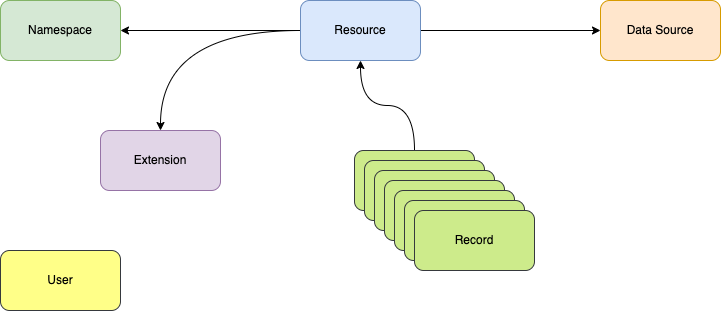

# Table of contents

* Core elements - Inside API Brew there are 6 main elements
    * [Resource](#resource)
    * [Record](#record)
    * [Data Source](#data-source)
    * [Namespace](#namespace)
    * [User](#user)
    * [Extension](#extension)
* [Property Types](#property-types)
* [Security Context](#security-context)
* [Resource Reference](#resource-reference)
* [Annotations](#annotations)
* [Miscellaneous](#miscellaneous)

# Core elements



## Resource

Resource is main element among all elements. Resource is for defining schema of your structure. After that you can do
crud operation inside resource.
When you crete new resource, it is defining same structure on its backend.

Depending on data source backend, it can store and manage data differently.

But for all data sources and for different backends (sql, mongo, redis, etc.). Everything is working as same.
**It means that, if you use postgresql and moved your resources from postgresql to mongodb everything will work as is.
**. It is internal logic of apibrew how it is handling operation on which backend. At high level, end user expects
that all data source backends are the same.

See [definition](proto.md#resource), [resource.proto](https://github.com/apibrew/apibrew/blob/master/proto/model/resource.proto)

### Special properties

When new resource is created or updated, *apibrew* appends some special properties to the resource.
These are:

* id - id field is primary key and record identifier. id special property will be added if resource does not any primary
  key. You can also prevent this happening by annotating resource with `DoPrimaryKeyLookup` annotation
* audit - audit special properties are for audit purposes and consist of 4 properties. By default, audit special
  properties will not be enabled. And it can be enabled by annotating resource with `EnableAudit` annotation.
    * created_on - if audit is enabled, this property will hold information about username who created record
    * created_by - if audit is enabled, this property will hold information when record created
    * updated_on - if audit is enabled, this property will hold information about username who updated record last time
    * updated_by - if audit is enabled, this property will hold information when record updated last time
* version - version property is added if you don't have such property and resource *is not* annotated with
  DisableVersion annotation

### Examples

#### City, Country

country.yml

```yaml
type: resource
name: country
sourceConfig:
  dataSource: default
  entity: country
properties:
  - name: name
    type: STRING
    length: 255
    required: true
    unique: true
  - name: description
    type: STRING
    length: 255
```

Now let's create country resource

```
apbr apply -f country.yml
```

city.yml

```yaml
type: resource
name: city
sourceConfig:
  dataSource: default
  entity: city
properties:
  - name: name
    type: STRING
    length: 255
    required: true
    unique: true
  - name: description
    type: STRING
    length: 255
  - name: country
    type: REFERENCE
    length: 255
    reference:
      referencedResource: country
      cascade: true
```

Now let's create city resource

```
apbr apply -f city.yml
```

So, by this way, you will create both country and city resources

## Record

### Overview

Record is a peace of data of resource. In basic words, If Resource is a table, Record is a row; If Resource is a
collection, Record is an item, etc.

### Record definition

Proto file: [resource.proto](https://github.com/apibrew/apibrew/blob/master/proto/model/record.proto)

Record has the following properties:

* **id** - unique record id, it is for identifying record. Record id comes from its resource property which is primary.
  If Resource has multiple primary properties, system will join them with dash. If no primary, id will be empty string
* **properties** - Properties is a map. Where key is property name and value is its value according to record. Mostly
  Properties is like a record body. It can be even considered record itself.
* **propertiesPacked** - This property is only available to GRPC and will be used instead of properties if pack mode is
  enabled. If pack mode enabled, properties will not be sent, instead propertiesPacked will be sent. It is for saving
  space and cpu for transferring many accounts.

### Examples

#### City, Country

data.yml

```yaml
type: record
resource: country
properties:
  name: Azerbaijan
  description: Land of fire
---
type: record
resource: city
properties:
  name: Baku
  country:
    name: Azerbaijan # This is for matching country by name
```

Now let's create country resource

```
apbr apply -f country.yml
```

## Data source

### Overview

Data source is for connecting our Resources to Databases/Data stores. Data source is main part of resource. And without
Datasource, Resource cannot physically store any data without datasource.

Data source is also an abstraction point for various databases.

### Data source definition

Proto file: [resource.proto](https://github.com/apibrew/apibrew/blob/master/proto/model/data-source.proto)

## Namespace

### Overview

Namespace is for grouping resources.

### Namespace definition

### Special namespaces:

1. Default namespace (name=default): Default namespace is auto create on initial setup. When new resource is created, if
   you have not defined namespace upon resource definition, default namespace
2. System namespace (name=system): System namespace is for holding all system resources.

## User

### Overview

User is for authentication purposes.

### User definition

## Extension

### Overview

Extensions is one of the main features of API Brew. Extensions is for extending capabilities of API Brew.
So you can define custom resources and you can define how it will work.

Extensions can be developed technically in any language which supports grpc protocol. But currently we have built in
support for golang.
So you can define a resource, an extension and you can develop how your resource will work.

### Extension definition

### External call definition

When function call is defined. API Brews sends request in following format:

```map<string, google.protobuf.Any> request```

Inside request, you will get followings
"resource": resource,
"request":  actualRequest,
"action":   string wrapper of action name,

Depending on which action is executed, we will have different payload.
For reference, you can take a look
to [record service proto definition](https://github.com/apibrew/apibrew/blob/master/proto/stub/record.proto)

For Http call you will have similar structure but in json format

# Property Types

Resource properties can have various types. API Brew supports following types:

API Brew is responsible to validate data according to property types. For example, when you call create record and
if you send 123.45 for int64

## Standard types

| Type name | Examples                             | Default          | Notes                                            |
|-----------|--------------------------------------|------------------|--------------------------------------------------|
| BOOL      | true, false                          | false            |                                                  |
| STRING    | "abc"                                | ""               |                                                  |
| FLOAT32   | 12.3, 93.1                           | 0                |                                                  |
| FLOAT64   | 12.3, 93.1                           | 0                |                                                  |
| INT32     | 123, 321                             | 0                |                                                  |
| INT64     | 123,321                              | 0                |                                                  |
| BYTES     | aGVsbG8gd29ybGQ=                     |                  | As internal representation base64 format is used |
| UUID      | f56558e1-9c7a-4146-b62c-43afb9f49d06 | zeroed uuid      |                                                  |
| DATE      | 2023-01-01                           | 1970-01-01       |                                                  |
| TIME      | 16:00                                | 00:00            |                                                  |
| TIMESTAMP | 2023-01-01T16:00                     | 1970-01-01T00:00 | We use RFC3339 format                            |

## Complex types

| Type name | Examples                           | Notes                       |
|-----------|------------------------------------|-----------------------------|
| MAP       | {"key": "value", "key2": "value2"} |                             |
| LIST      | [123, 321]                         |                             |
| REFERENCE |                                    |                             |
| ENUM      | "PROCESSING"                       |                             |
| OBJECT    |                                    | Object type is for any type |

### Map type

Map type is for complex data structures. Maps have key and values. Key type is always string But value type can be any
of existing types
You can define value type by setting **subType** field on property

### List type

List type is for complex data structures.
You can define value type by setting **subType** field on property

### Enum type

Enum type is to have values from predefined value set.
You can define enum values by setting **enumValues** (list of possible values)
While using enum values you can use its string representation or number value(ordinal value)

### Object type

Object type is for any kind of values. If property type is Object type, you can set any possible values (according to
existing types) to it

### Reference type

See [Reference type](#reference-type)

## Type other representations

| Type name | Golang Type            | Json/Yaml       | Proto type (packed: inside structpb.Value) |
|-----------|------------------------|-----------------|--------------------------------------------|
| BOOL      | bool                   | bool            | bool_value(bool)                           |
| STRING    | string                 | string          | string_value(string)                       |
| FLOAT32   | float32                | number          | number_value(double)                       |
| FLOAT64   | float64                | number          | number_value(double)                       |
| INT32     | int32                  | number          | number_value(double)                       |
| INT64     | int64                  | number          | number_value(double)                       |
| BYTES     | []byte                 | string (base64) | string_value(string)                       |
| UUID      | uuid.UUID              | string          | string_value(string)                       |
| DATE      | time.Time              | string          | string_value(string)                       |
| TIME      | time.Time              | string          | string_value(string)                       |
| TIMESTAMP | time.Time              | string          | string_value(string)                       |
| MAP       | map[string]interface{} | object          | structpb.Struct                            |
| LIST      | []interface{}          | array           | structpb.ListValue                         |
| REFERENCE | map[string]interface{} | object          | structpb.Struct                            |
| ENUM      | string                 | string          | string_value(string)                       |
| OBJECT    | map[string]interface{} | object          | structpb.Struct                            |

You can use following code to convert golang type to prototype (packed)

```go
val := "test-value"
packedType := types.ByResourcePropertyType(model.ResourceProperty_STRING).Pack(val)

```

# Security Context

API Brew has the ability to define access control of actions on resources

Security context can be attached to following levels:

1. User - User security context controls which permissions user has
2. Namespace - Namespace security context controls which permissions resources has inside namespace
3. Resource - Resource security context controls which permissions resources has
4. Property - Property security context controls which permissions property has

## Security Context definition

Proto file: [security.proto](https://github.com/apibrew/apibrew/blob/master/proto/model/security.proto)
SecurityContext has the following properties:

* **namespace** - namespace name where it will be applied
* **resource** - resource name where it will be applied
* **property** - property name where it will be applied
* **before** - before it is valid
* **after** - after it is valid
* **principal** - username which it is applied to
* **recordIds** - list of record ids which it is applied to
* **operation** - operation name which it is applied to
    * OPERATION_TYPE_READ
    * OPERATION_TYPE_CREATE
    * OPERATION_TYPE_UPDATE
    * OPERATION_TYPE_DELETE
    * FULL
* **permit** - permission
    * PERMIT_TYPE_ALLOW - it means that it is allowed
    * PERMIT_TYPE_REJECT - it means that it is rejected
    * PERMIT_TYPE_UNKNOWN - it means that permission should be ignored

Security context can be defined in various places. But some properties is ignored if it is already known.
For example, if security context is applied to user, then principal value is ignored, whatever you set to principal,
it will be user's username. Same for namespace, if security context is attached to namespace, security context namespace
will become namespace name where it is assigned to namespace

While deciding about whether operation is permitted or not, API Brew checks security context in following levels:

1. Property
2. Resource
3. Namespace
4. User

It means that, if Property security context is rejecting access but user allows it, end result will be reject

If there are multiple security context defined in one level, and they are matching requested operation. Then highest
matching security context will be considered.
It means that if you have one security constraint Rejecting but another is Unknown and both are in user level, Unknown
will be considered

While deciding about permission, security control checks levels from top to bottom. And it will stop in the first found
Reject or Allow permission.
If Reject or Allow found, it will be the decision.

If neither Reject nor Allow found end result will become Unknown.

If end result is Unknown, API Brew checks if this resource is publicely available, if yes, operation will be
allowed, if not, it will be denied

public access can be defined by creating a security context which has principal named guest

# Resource reference

Reference type is one of main type of API Brew. Reference type is for building relationships between resources. It
is like a column with Foreign key in relation databases.

When you set property type to reference type, it is required to set reference details.
An example for reference type definition

#### Example

```yaml
type: resource
name: country
properties:
  - name: name
    type: STRING
    length: 255
    required: true
    unique: true
---
type: resource
name: city
properties:
  - name: name
    type: STRING
    length: 255
    required: true
    unique: true
  - name: country
    type: REFERENCE
    reference:
      referencedResource: country
      cascade: true
```

Basically:

```yaml
    reference:
      referencedResource: country
      cascade: true
```

* **referencedResource** - referenced resource is the relationship between resources. In the example you can see
  relationship between country to city
* **cascade** - when cascade is set to true you, cascade delete operation

#### Reference type resolution, Record identification

There are two kinds of reference type resolution

##### Resolution by primary properties:

Setting reference property value by primary property

```yaml
type: record
resource: city
properties:
  name: Baku
  country: # reference property
    id: f56558e1-9c7a-4146-b62c-43afb9f49d06 # primary property
```

As a rule, if you have single primary property, it should be set, and it should have a value rather than default value.
If there are multiple primary properties. All should have a value and all should have value different than default value

##### Resolution by unique properties

Setting reference property value by unique property

```yaml
type: record
resource: city
properties:
  name: Baku
  country: # reference property
    name: Azerbaijan # unique name property
```

As a rule, if one of the unique properties is set, it is enough for type resolution

# Annotations

Annotations are used to cover additional situations which are not part of core functionality.

Each annotation has a scope, it can be used in different parts of the application

| Annotation      | Scope    | Type   | Description                                                                                                                                                                 | Examples |
|-----------------|----------|--------|-----------------------------------------------------------------------------------------------------------------------------------------------------------------------------|----------|
| KeepHistory     | Resource | bool   | Keep History is a flag to keep record history                                                                                                                               | false    |
| AutoCreated     | Resource | bool   | This annotation is enabled for prepared entities from datasource                                                                                                            |          |
| EnableAudit     | Resource | bool   | This annotation is to enable audit on resource                                                                                                                              |          |
| DisableVersion  | Resource | bool   | By default version is enabled on resource, so it will have version column, if this annotation is enabled version will not be supported and version column will not be added |          |
| DisableBackup   | Resource | bool   | If this annotation is enabled, resource will not be available on bakups                                                                                                     |          |
| SourceDef       | Property | string | For prepared resource, actual backend related may stored in this column                                                                                                     |          |
| SourceIdentity  | Property | string |                                                                                                                                                                             |          |
| SourceMatchKey  | Property | string |                                                                                                                                                                             |          |
| Identity        | Property | string |                                                                                                                                                                             |          |
| SpecialProperty | Property | bool   |                                                                                                                                                                             |          |
| IsHclLabel      | Hcl      | bool   | This annotation is to mark property as HCL label                                                                                                                            |          |
| HclBlock        | Hcl      | bool   | This annotation is to mark property as HCL block                                                                                                                            |          |

# Miscellaneous
